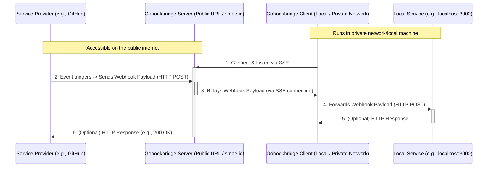
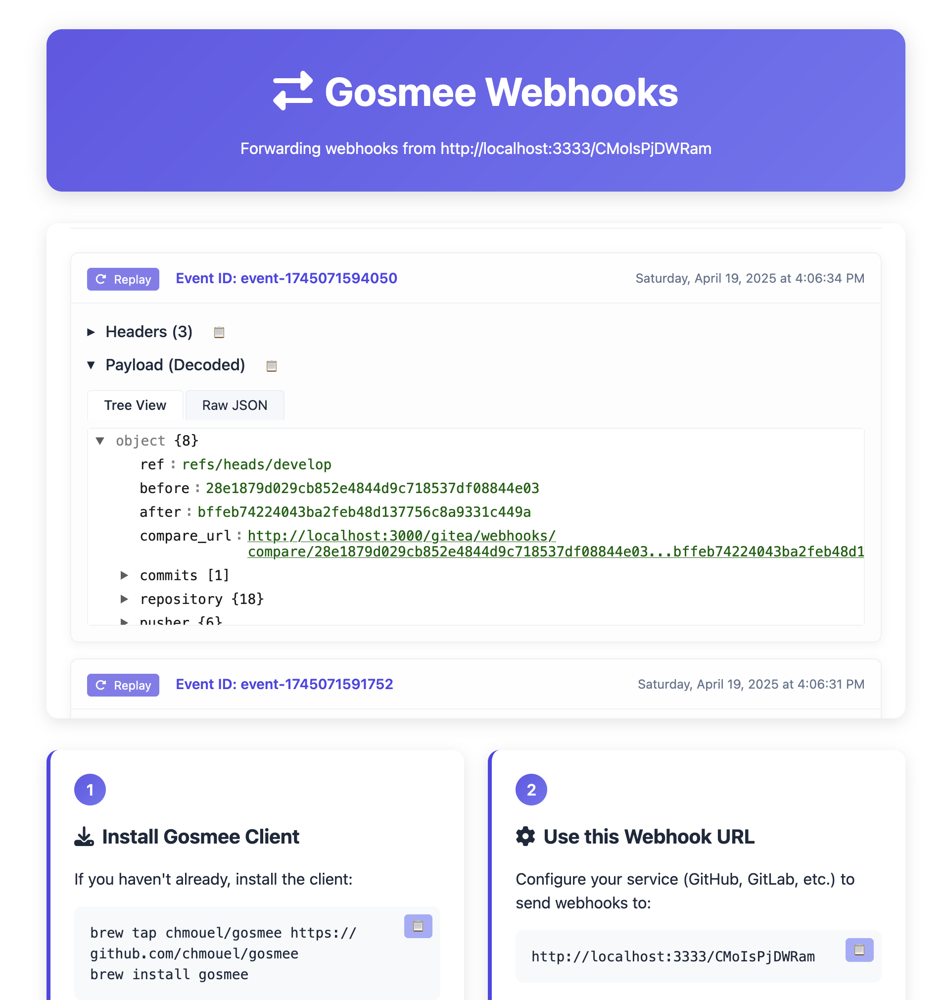

# gohookbridge - A webhook forwarder, relayer, and replayer


Gohookbridge is a webhook relayer that runs anywhere with ease. It also serves as a GitHub Hooks replayer using the GitHub API.

## Description

Gohookbridge enables you to relay webhooks from itself (as a server) or from <https://smee.io> to your local laptop or infrastructure hidden from the public internet.

It makes exposing services on your local network (like localhost) or behind a VPN quite straightforward. This allows public services, such as GitHub, to push webhooks directly to your local environment.

Here's how it works:

1. Configure your webhook to send events to a <https://smee.io/> URL or to your publicly accessible Gohookbridge server.
2. Run the Gohookbridge client on your local machine to fetch these events and forward them to your local service.

This creates a proper bridge between GitHub webhooks and your local development environment.

Alternatively, if you'd rather not use a relay server, you can use the GitHub API to replay webhook deliveries directly. (beta)

### Diagram

For those who prefer a visual explanation of how gohookbridge works:

#### Simple


#### Detailed



## Blog Post

Learn more about the background and features of this project in this blog post: <https://blog.chmouel.com/posts/gosmee-webhook-forwarder-relayer>

## Screenshot



### Live Event Feed

The web interface of the gohookbridge server features a live event feed that shows webhook events in real-time:

- Live status indicator showing connection state
- Event counter showing number of received events
- JSON tree viewer for easy payload inspection
- Copy buttons for headers and payloads
- Replay functionality to resend events to your endpoint
- Clear button to remove all events from the feed

Each event in the feed shows:

- Event ID and timestamp
- Headers with copy functionality
- Payload in both tree view and raw JSON formats
- Option to replay individual events

## Installation

### Release

Please visit the [release](https://github.com/webcenter-fr/gohookbridge/releases) page and choose the appropriate archive or package for your platform.

## Homebrew

```shell
brew tap webcenter-fr/gohookbridge https://github.com/webcenter-fr/gohookbridge
brew install gohookbridge
```

## [Arch](https://aur.archlinux.org/packages/gohookbridge-bin)

```shell
yay -S gohookbridge-bin
```

### Docker

#### Gohookbridge client with Docker

```shell
docker run ghcr.io/webcenter-fr/gohookbridge:latest
```

#### Gohookbridge server with Docker

```shell
docker run -d -p 3026:3026 --restart always --name example.org ghcr.io/webcenter-fr/gohookbridge:latest server --port 3026 --address 0.0.0.0 --public-url https://example.org
```

### GO

```shell
go install -v github.com/webcenter-fr/gohookbridge@latest
```

### Git

Clone the repository and use:

```shell
-$ make build
-$ ./bin/gohookbridge --help
```

### [Nix/NixOS](https://nixos.org/)

Gohookbridge is available from [`nixpkgs`](https://github.com/NixOS/nixpkgs).

```shell
nix-env -iA gohookbridge
nix run nixpkgs#gohookbridge -- --help # your args are here
```

### System Services

System service example files for macOS and Linux are available in the [misc](./misc) directory.

### Kubernetes

You can deploy gohookbridge on Kubernetes to relay webhooks to your internal services.

#### Helm

The Helm chart is published as an OCI artifact to GHCR:

```shell
# Install the server
helm install gohookbridge oci://ghcr.io/webcenter-fr/gohookbridge \
  --set server.enabled=true \
  --set server.publicURL=https://webhook.example.com

# Install with client forwarding
helm install gohookbridge oci://ghcr.io/webcenter-fr/gohookbridge \
  --set server.enabled=true \
  --set client.enabled=true \
  --set client.channelURL=https://webhook.example.com/my-channel \
  --set client.targetURL=http://my-service:8080

# Install with encrypt proxy
helm install gohookbridge oci://ghcr.io/webcenter-fr/gohookbridge \
  --set proxy.enabled=true \
  --set proxy.targetURL=https://webhook.example.com/my-channel \
  --set proxy.publicKey=YOUR_PUBLIC_KEY
```

For full Helm configuration options, see [`helm/gohookbridge/values.yaml`](./helm/gohookbridge/values.yaml).

#### Raw YAML manifests

Two deployment configurations are available:

- [gohookbridge-server-deployment.yaml](./misc/gohookbridge-server-deployment.yaml) - For deploying the public-facing server component
- [gohookbridge-client-deployment.yaml](./misc/gohookbridge-client-deployment.yaml) - For deploying the client component that forwards to internal services

#### Server Deployment

The server deployment exposes a public webhook endpoint to receive incoming webhook events:

```shell
kubectl apply -f misc/gohookbridge-server-deployment.yaml
```

Key configuration:

- Set `--public-url` to your actual domain where the service will be exposed
- Configure an Ingress with TLS or use a service mesh for production use
- Set `--raft-dir` to a persistent volume for Raft data durability
- Add `--bootstrap-config-file` pointing to a ConfigMap or Secret with your bootstrap configuration
- For security, configure webhook signatures, allowed IPs, and auth via `bootstrap.yaml` or Admin UI
- Configure `behind_reverse_proxy` in global config when your Ingress is the sole path to gohookbridge and overwrites `X-Forwarded-For` / `X-Real-IP`; otherwise the allowlist can be bypassed by spoofed headers (see [SECURITY.md](./SECURITY.md#behind-a-reverse-proxy-safely))

#### Client Deployment

The client deployment connects to a gohookbridge server (either your own or smee.io) and forwards webhook events to internal services:

```shell
kubectl apply -f misc/gohookbridge-client-deployment.yaml
```

Key configuration:

- Adjust the first argument to your gohookbridge server URL or smee.io channel
- Change the second argument to your internal service URL (e.g., `http://service.namespace:8080`)
- The `--saveDir` flag enables saving webhook payloads to `/tmp/save` for later inspection

For detailed configuration options, please refer to the documentation comments in each deployment file.

### Shell completion

Shell completions are available for gohookbridge:

```shell
# BASH
source <(gohookbridge completion bash)

# ZSH
source <(gohookbridge completion zsh)
```

## Usage

### Client

If you plan to use the <https://smee.io> service, you can generate your own smee URL by visiting <https://smee.io/new>.

If you want to use the <https://hook.pipelinesascode.com> service then you can directly generate a URL with the `-u / --new-url` flag.

Once you have the relay URL, the basic usage is:

```shell
gohookbridge client https://smee.io/aBcDeF https://localhost:8080
```

This command will relay all payloads received by the smee URL to a service running on <http://localhost:8080>.

You can also save all relays as shell scripts for easy replay:

```shell
gohookbridge client --saveDir /tmp/savedreplay https://smee.io/aBcDeF https://localhost:8080
```

This command saves the JSON data of new payloads to `/tmp/savedreplay/timestamp.json` and creates shell scripts with cURL options at `/tmp/savedreplay/timestamp.sh`. Replay webhooks easily by running these scripts.

You can configure the SSE client buffer size (in bytes) with the `--sse-buffer-size` flag. The default is `1048576` (1MB).

#### Protected channels

Protected channels are optional and only apply to channel IDs listed in the server's `--encrypted-channels-file`.

Plaintext gohookbridge channels still work without a key file:

```shell
gohookbridge client https://myserverurl/plain-channel https://localhost:8080
```

When connecting to a protected channel on your own `gohookbridge server`, the client must use a pre-generated keypair file. There is no client-side auto-generation during `gohookbridge client` startup.

Generate a keypair once:

```shell
gohookbridge keygen --key-file ~/.config/gohookbridge/client-key.json
```

This writes the private key file and prints the corresponding public key to stdout. Add that public key to the server's protected-channel config.

Then connect with the key file:

```shell
gohookbridge client --encryption-key-file ~/.config/gohookbridge/client-key.json https://myserverurl/CHANNEL_ID https://localhost:8080
```

Notes:

- This protected-channel flow only works with gohookbridge's own SSE endpoint. `https://smee.io` does not use client keys.
- Payloads are encrypted end-to-end: the server encrypts webhook bodies with the channel's public key at ingest time and stores only ciphertext. The client decrypts with the private key.
- For pre-encrypted sending, use `gohookbridge produce` to encrypt and POST a payload directly:

```shell
gohookbridge produce --pubkey <channel-public-key> https://myserverurl/CHANNEL_ID payload.json
```

- For transparent encryption of standard webhooks, use `gohookbridge proxy` as a local encrypt proxy:

```shell
gohookbridge proxy --pubkey <channel-public-key> --listen :9090 --target https://myserverurl/CHANNEL_ID
```

- The proxy receives plaintext webhooks from standard providers and encrypts them before forwarding to the gohookbridge server.
- Saved payloads from `--saveDir` are written after decryption on the client side.

For those who prefer [HTTPie](https://httpie.io) over cURL, you can generate HTTPie-based replay scripts:

```shell
gohookbridge client --httpie --saveDir /tmp/savedreplay https://smee.io/aBcDeF https://localhost:8080
```

This will create replay scripts that use the `http` command instead of `curl`. The generated scripts support the same features as cURL scripts; the output will be rather nicer and presented in colour.

You can ignore certain events (identified by GitLab/GitHub/Bitbucket) with one or more `--ignore-event` flags.

If you only want to save payloads without replaying them, use `--noReplay`.

By default, you'll get colourful output unless you specify `--nocolor`.

Output logs as JSON with `--output json` (which implies `--nocolor`).

#### Executing commands on webhook events

You can execute a shell command whenever a webhook event is received using `--exec`:

```shell
gohookbridge client --exec 'jq . $GOSMEE_PAYLOAD_FILE' https://smee.io/aBcDeF http://localhost:8080
```

The payload and headers are written to temporary files (automatically cleaned up after the command finishes). The following environment variables are set:

| Variable | Description |
|---|---|
| `GOSMEE_EVENT_TYPE` | The event type (e.g., `push`, `pull_request`) |
| `GOSMEE_EVENT_ID` | The delivery ID |
| `GOSMEE_CONTENT_TYPE` | The content type of the payload |
| `GOSMEE_TIMESTAMP` | The timestamp of the event |
| `GOSMEE_PAYLOAD_FILE` | Path to a temporary file containing the JSON payload body |
| `GOSMEE_HEADERS_FILE` | Path to a temporary file containing the webhook headers as JSON |

To only run the command for specific event types, use `--exec-on-events`:

```shell
gohookbridge client --exec './handle-push.sh' --exec-on-events push --exec-on-events pull_request https://smee.io/aBcDeF http://localhost:8080
```

By default, `--exec` runs with a minimal, safe environment (for example `PATH`, `HOME`, and locale-related variables), not the full gohookbridge process environment. To pass additional variables through, use `--exec-env-vars VAR_NAME` (repeat the flag for multiple names), or set `GOSMEE_EXEC_ENV_VARS` as a comma-separated list.

The `--exec` command runs **synchronously** after the webhook is forwarded to the target URL (if replay is enabled). A slow command will delay processing of subsequent events. If you need asynchronous execution, background your command (e.g., `--exec './my-script.sh &'`). A non-zero exit code is logged as an error but does not stop processing further events.

Both `--exec` and `--exec-on-events` also work with the `replay` command.

> **Security Warning**: The `--exec` flag runs arbitrary shell commands with
> the webhook payload available via `$GOSMEE_PAYLOAD_FILE`. When receiving
> webhooks from untrusted sources, a malicious payload could exploit a
> naively written script (e.g., one that passes unsanitized fields to shell
> commands). Always validate and sanitize webhook payloads in your exec
> scripts. Consider using `--webhook-signature` on the server side to verify
> webhook authenticity.

#### Replay scripts

Both cURL and HTTPie replay scripts include these command-line options:

- `-l, --local`: Use local debug URL
- `-t, --target URL`: Specify target URL directly
- `-h, --help`: Show help message
- `-v, --verbose`: Enable verbose output

**Examples:**

```shell
# Use local debug endpoint
./timestamp.sh -l

# Specify custom target URL
./timestamp.sh -t http://custom-service:8080

# Use verbose mode for debugging
./timestamp.sh -v

# Show help
./timestamp.sh -h
```

Scripts also respect the `GOSMEE_DEBUG_SERVICE` environment variable for alternative target URLs.

### Server

With `gohookbridge server` you can run your own relay server instead of using <https://smee.io>.

By default, `gohookbridge server` binds to `localhost` on port `3333`. For practical use, you'll want to expose it to your public IP or behind a proxy using the `--address` and `--port` flags.

For security, you can use Let's Encrypt certificates with the `--tls-cert` and `--tls-key` flags.

Configuration is managed through the Raft consensus store, bootstrapped via `bootstrap.yaml` or managed through the Admin UI at `/admin`.

There are many flags available - check them with `gohookbridge server --help`.

#### Bootstrap Configuration

On first boot, pass a `bootstrap.yaml` file to initialize the Raft store with an admin user, projects, and global settings:

```shell
gohookbridge server --bootstrap-config-file /etc/gohookbridge/bootstrap.yaml
```

Example `bootstrap.yaml`:

```yaml
global:
  server:
    session_secret: "your-32-byte-hex-secret"
    cors_origin: "https://dashboard.example.com"
    max_body_size: 26214400
    behind_reverse_proxy: true
  defaults:
    webhook_signatures: ["global-webhook-secret"]
    allowed_ips: ["192.30.252.0/22"]
    replay_token: "global-replay-token"
users:
  - username: admin
    password: "your-strong-password"
    roles: ["admin"]
    projects: ["*"]
projects:
  - id: my-project
    name: My Project
    webhook_signatures: ["project-specific-secret"]
    allowed_ips: ["10.0.0.0/8"]
```

The bootstrap file is read **once** on the very first boot when the Raft store is empty. After that, use the Admin UI or API to manage configuration.

#### Raft Flags

| Flag | Default | Description |
|---|---|---|
| `--raft-dir` | `./raft-data` | Raft data directory (BoltDB stores) |
| `--raft-node-id` | `node1` | Unique Raft node ID |
| `--raft-bind-addr` | `127.0.0.1:6001` | Raft TCP bind address for inter-node communication |
| `--raft-peers` | | Other Raft node IDs and addresses (node2=addr:port,node3=addr:port) |
| `--bootstrap-config-file` | | Path to bootstrap YAML/JSON config file (read once when FSM is empty) |
|---|---|---|

#### NATS Flags

Available when using the embedded NATS server for real-time webhook fan-out across cluster instances.

| Flag | Default | Description |
|---|---|---|
| `--nats-port` | `0` | Embedded NATS server client port. `0` = disabled (uses in-memory EventBroker) |
| `--nats-cluster-port` | `6222` | NATS cluster route port for inter-node communication |
| `--nats-routes` | | NATS cluster route URLs (`nats://host:6222`). Required for HA, same hosts as `--raft-peers` |
| `--nats-buffer-ttl` | `1h` | How long webhook data is retained in the ring buffer for late subscribers |
| `--nats-buffer-size` | `10000` | Max number of webhook entries kept in the ring buffer |

#### Admin UI

The Admin UI at `/admin` provides a web interface for managing:

- Projects (create, update, delete)
- Users and their roles
- Global configuration
- RBAC roles and bindings

Access to the Admin UI requires a valid session (login via `/login`). On first boot with no users, create an admin user via `bootstrap.yaml`.

#### Using Your Server

To use your server in normal plaintext mode, access it with a URL format like:

<https://myserverurl/RANDOM_ID>

The random ID must be 12 characters long with characters from `a-zA-Z0-9_-`.

Generate a random ID easily with the `/new` endpoint:

```shell
% curl http://localhost:3333/new
http://localhost:3333/NqybHcEi
```

#### Protected client channels

If you want specific channels to be end-to-end encrypted, enable `encryption_mode: e2e` on the channel via `bootstrap.yaml` or Admin UI, and set `encryption_public_key` to the channel's public key. The channel uses a single shared keypair: producers encrypt with the public key, clients decrypt with the private key.

Example channel with E2E encryption:

```yaml
projects:
  - id: customer-a-channel
    name: Customer A
    encryption_mode: e2e
    encryption_public_key: "CHANNEL_PUBLIC_KEY_BASE64URL"
```

For server-side encryption (AES-256-GCM), use `encryption_mode: server_side` with `encryption_key`.

Key points:
- Channels with `encryption_mode: e2e` are protected and require authentication to subscribe.
- All events on an E2E channel are encrypted with the single shared channel public key.
- The private key is distributed to authorized clients via the Admin UI or Kubernetes Secrets.
- Standard webhook providers can POST plaintext directly — the server encrypts automatically.
- For true E2E (server never sees plaintext), use `gohookbridge produce` or `gohookbridge proxy`.
```

Important:

- Only projects with `encryption_enabled: true` are protected.
- A protected channel only delivers to clients whose public key is listed for that channel.
- Unauthorized subscribers to a protected channel receive a generic not-found response.
- The built-in browser UI and `/new` remain available for plaintext channels, but protected channels are not exposed through the browser UI.

#### Caddy

[Caddy](https://caddyserver.com/) is rather ideal for running gohookbridge server:

```caddyfile
https://webhook.mydomain {
    reverse_proxy http://127.0.0.1:3333 {
        header_up X-Real-IP {remote_host}
        header_up X-Forwarded-For {remote_host}
    }
}
```

It automatically configures Let's Encrypt certificates for you.

#### Nginx

Running gohookbridge server behind nginx requires some configuration:

```nginx
    location / {
        proxy_pass         http://127.0.0.1:3333;
        proxy_set_header Connection '';
        proxy_set_header X-Real-IP $remote_addr;
        proxy_set_header X-Forwarded-For $remote_addr;
        proxy_http_version 1.1;
        chunked_transfer_encoding off;
        proxy_read_timeout 372h;
    }
```

> [!IMPORTANT]
> If you run gohookbridge with `behind_reverse_proxy: true` in global config (required for IP allowlisting to work behind a proxy), the proxy must be the only way to reach gohookbridge and must **overwrite** the forwarded headers. The examples above bind/proxy to `127.0.0.1:3333`, so keep that port off the public internet (do not publish it directly).
>
> The nginx snippet sets `X-Forwarded-For $remote_addr` (the connection address) rather than `$proxy_add_x_forwarded_for`. The latter *appends* to any client-supplied `X-Forwarded-For`, which would leave an attacker-controlled value first — and gohookbridge trusts the first entry. See [SECURITY.md](./SECURITY.md#behind-a-reverse-proxy-safely) for details.

Note: Long-running connections may occasionally cause errors with nginx. Contributions to debug this are most welcome.

#### Security

- Replay tokens: configure `replay_token` per-project or globally via `bootstrap.yaml` or Admin UI. Require `Authorization: Bearer <token>` on `POST /replay/{channel}`.
- CORS origin: configure `cors_origin` in global config via `bootstrap.yaml` or Admin UI. Controls `Access-Control-Allow-Origin` for the SSE stream. Default is `*`.
- Authentication: users with passwords (bcrypt), OIDC providers, session-based login. HMAC-SHA256 signed cookies with 24h expiry.
- RBAC: role-based access control with three default roles (`admin`, `project_admin`, `project_viewer`). Custom roles via API.
- All configuration is stored in the Raft consensus store and managed via Admin UI or `bootstrap.yaml`.

For a full security reference — including webhook signature validation, IP restrictions, payload limits, channel ID validation, and encrypted channels — see [SECURITY.md](./SECURITY.md).

## High Availability with NATS

Gohookbridge uses a two-layer architecture for high availability:
- **Raft** (ports 6001): replicates **configuration** (projects, users, global settings). Slow, durable, strongly consistent.
- **NATS** (ports 4222/6222): distributes **webhook data** in real time. Fast, ephemeral, eventually consistent.

When NATS is enabled (`--nats-port 4222`), each gohookbridge instance embeds a `nats-server` that forms a cluster with peers specified via `--nats-routes`. Webhook payloads published to any instance are fanned out to all instances via the NATS cluster, ensuring SSE clients receive events regardless of which instance they are connected to. A per-instance ring buffer (configurable via `--nats-buffer-ttl` and `--nats-buffer-size`) provides late subscriber catch-up.

### Port layout

| Port | Protocol | Purpose |
|---|---|---|
| 3333 | HTTP/HTTPS | Webhook ingestion + SSE + Admin UI + API |
| 6001 | TCP (Raft) | Configuration consensus between Raft nodes |
| 4222 | TCP (NATS client) | NATS client connections (in-process, localhost only) |
| 6222 | TCP (NATS cluster) | NATS inter-node cluster routes |

### HA deployment example

```bash
# Instance 1
gohookbridge server \
  --address 0.0.0.0 --port 3333 \
  --public-url https://webhook.example.com \
  --raft-dir /data/raft \
  --raft-node-id node1 \
  --raft-bind-addr 10.0.0.1:6001 \
  --raft-peers node2=10.0.0.2:6001,node3=10.0.0.3:6001 \
  --nats-port 4222 \
  --nats-cluster-port 6222 \
  --nats-routes nats://10.0.0.2:6222,nats://10.0.0.3:6222 \
  --nats-buffer-ttl 1h \
  --nats-buffer-size 10000 \
  --bootstrap-config-file /etc/gohookbridge/bootstrap.yaml

# Instance 2
gohookbridge server \
  --address 0.0.0.0 --port 3333 \
  --public-url https://webhook.example.com \
  --raft-dir /data/raft \
  --raft-node-id node2 \
  --raft-bind-addr 10.0.0.2:6001 \
  --raft-peers node1=10.0.0.1:6001,node3=10.0.0.3:6001 \
  --nats-port 4222 \
  --nats-cluster-port 6222 \
  --nats-routes nats://10.0.0.1:6222,nats://10.0.0.3:6222 \
  --bootstrap-config-file /etc/gohookbridge/bootstrap.yaml
```

See [design.md](./design.md) for the full architecture document with data flow diagrams and HA scenario details.

## Replay Webhook Deliveries via the GitHub API (beta)

If you'd rather not use a relay server with GitHub, you can replay webhook deliveries directly via the GitHub API.

This method is more reliable as you don't depend on relay server availability. You'll need a GitHub token with appropriate scopes:

- For repository webhooks: `read:repo_hook` or `repo` scope
- For organisation webhooks: `admin:org_hook` scope

Currently supports replaying webhooks from Repositories and Organisations (GitHub Apps webhooks not supported).

First, find the Hook ID:

```shell
gohookbridge replay --github-token=$GITHUB_TOKEN --list-hooks org/repo
```

List hooks for an organisation:

```shell
gohookbridge replay --github-token=$GITHUB_TOKEN --list-hooks org
```

Start listening and replaying events on a local server:

```shell
gohookbridge replay --github-token=$GITHUB_TOKEN org/repo HOOK_ID http://localhost:8080
```

This will listen to all **new** events and replay them to <http://localhost:8080>.

Replay all events received since a specific time (UTC format `2023-12-19T12:31:12`):

```shell
gohookbridge replay --time-since=2023-12-19T09:00:00 --github-token=$GITHUB_TOKEN org/repo HOOK_ID http://localhost:8080
```

To find the right date, list all deliveries:

```shell
gohookbridge replay --github-token=$GITHUB_TOKEN --list-deliveries org/repo HOOK_ID
```

>[!NOTE]
>`gohookbridge replay` doesn't support paging yet and lists only the last 100 deliveries. Specifying a date older than the last 100 deliveries won't work.
>
>When rate limited, gohookbridge will fail without recovery mechanisms.

## Replay Viewer Utility

<https://github.com/user-attachments/assets/dbd0978a-a8ef-4e77-b498-672497567b39>

Gohookbridge includes a helper script [`misc/replayview`](./misc/replayview) for interactively browsing, previewing, and replaying webhook events saved by the client (`--saveDir`). This tool lets you:

- Fuzzy-find replay shell scripts and their JSON payloads
- Preview event metadata, headers, and payloads
- Copy replay script paths to clipboard
- Create symlinks for quick access
- Run replay scripts directly
- Interactively inspect JSON payloads (requires [`fx`](https://github.com/antonmedv/fx))

**Usage:**

```sh
./misc/replayview -h
```

By default, it looks for replay files in `/tmp/save` or `/tmp/replay`. Use `-d <dir>` to specify a different directory.

It will create a symbolic link of the chosen replay event to the file `/tmp/run.sh`, which redirects the event to the local service for easy payload replay.

**Requirements:** `fzf`, `jq`, `fd`, and optionally [fx](https://fx.wtf/) for interactive JSON viewing.

See the script header or run with `-h` for full options and details.

## Beyond Webhook

Gohookbridge is webhook-specific. For other tunnelling solutions, check <https://github.com/anderspitman/awesome-tunneling>. Recommended alternatives include [go-http-tunnel](https://github.com/mmatczuk/go-http-tunnel) or [tailscale](https://tailscale.com/).

## Caveats

- Auth and RBAC are now production-grade features. The Admin UI at `/admin` provides session-based authentication, OIDC support, and role-based access control.
- Raft provides a multi-node consensus layer for high availability, but there is no built-in TLS for Raft inter-node communication. Run Raft on private network interfaces and protect the Raft port with firewalls.
- Recovery from a full cluster failure requires operator intervention (restore from snapshot or re-initialize the Raft cluster).
- Protected channels with encryption are only available when using gohookbridge's own server (not smee.io).
- This tool is primarily intended for development and testing environments. It hasn't undergone thorough security and performance reviews for all production deployment scenarios.

[smee-sidecar](https://github.com/konflux-ci/smee-sidecar) is a service intended for monitoring gohookbridge deployments. It provides active health checks to verify that gohookbridge is serving requests.

## Thanks

- Most of the work is powered by the [go-sse](https://github.com/r3labs/sse) library.
- I previously used [pysmee](https://github.com/akrog/pysmee) but its underlying SSE library had issues with chunked transfers, that leads me to rewrite it in Go and add some specific features needed for my use cases.

## Copyright

[MIT](./LICENSE)

## Authors

### Chmouel Boudjnah

- Fediverse - <[@chmouel@chmouel.com](https://fosstodon.org/@chmouel)>
- Twitter - <[@chmouel](https://twitter.com/chmouel)>
- Blog  - <[https://blog.chmouel.com](https://blog.chmouel.com)>
