# Gohookbridge HA Webhook Relay — Architecture Design Document

## Table of Contents

1. [Global Architecture](#global-architecture)
2. [Component Details](#component-details)
   - [Raft — Configuration Consensus](#raft--configuration-consensus)
   - [NATS — Real-time Webhook Fan-out](#nats--real-time-webhook-fan-out)
   - [Ring Buffer — Late Subscriber Catch-up](#ring-buffer--late-subscriber-catch-up)
   - [SSE Endpoint — Client Subscribe/Push](#sse-endpoint--client-subscribepush)
3. [Data Flows](#data-flows)
   - [Webhook POST (Publish)](#webhook-post-publish)
   - [SSE Subscribe + Receive](#sse-subscribe--receive)
   - [Replay POST](#replay-post)
   - [Ring Buffer Eviction](#ring-buffer-eviction)
4. [HA Scenarios](#ha-scenarios)
   - [Cross-instance Delivery](#cross-instance-delivery)
   - [Late Subscriber Join](#late-subscriber-join)
   - [Node Failure](#node-failure)
5. [Configuration Mapping](#configuration-mapping)
6. [Backward Compatibility](#backward-compatibility)

---

## Global Architecture

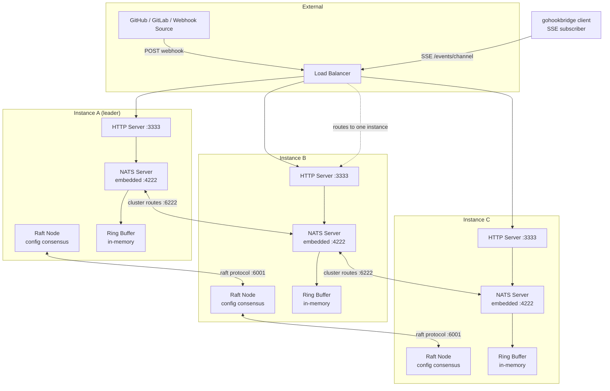

**Key insight:** Raft and NATS are two independent consensus/messaging layers with different purposes:
- **Raft** (port 6001): replicates **configuration** (projects, users, global settings). Slow, durable, strongly consistent.
- **NATS** (ports 4222/6222): distributes **webhook data** in real time. Fast, ephemeral, eventually consistent.

---

## Component Details

### Raft — Configuration Consensus

Raft is used **exclusively for configuration**. It stores projects, users, roles, and global settings in a BoltDB-backed FSM (Finite State Machine).

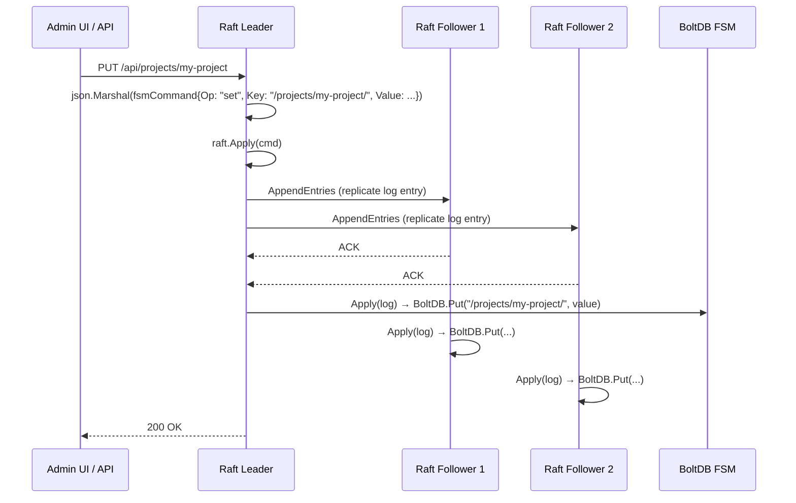

**Storage layout in BoltDB (`fsm_data` bucket):**

| Key | Value | Purpose |
|---|---|---|
| `/global/server/` | `ServerConfig` JSON | MaxBodySize, BehindReverseProxy, CORS, etc. |
| `/global/defaults/` | `DefaultProjectConfig` JSON | Default signatures, allowed IPs, replay token |
| `/projects/{id}/` | `Project` JSON | Per-project overrides |
| `/users/{id}/` | `User` JSON | Username, password hash, roles, projects |
| `/users/by-username/{name}/` | `usernameIndex` JSON | Username → UserID lookup |
| `/rbac/roles/{name}/` | `Role` JSON | Custom RBAC roles |
| `/meta/setup_end` | `time.Time` JSON | Setup mode expiry |
| `/global/auth/oidc_providers` | `[]OIDCProvider` JSON | OIDC providers list |

**Key Raft configuration (from `store/raft.go`):**

| Parameter | Value | Purpose |
|---|---|---|
| `HeartbeatTimeout` | 1s | Leader heartbeat interval |
| `ElectionTimeout` | 1s | Follower starts election after |
| `LeaderLeaseTimeout` | 500ms | Leader steps down if can't reach quorum |
| `CommitTimeout` | 50ms | Batch commit interval |
| `SnapshotInterval` | 120s | Snapshot frequency |
| `SnapshotThreshold` | 8192 entries | Trigger snapshot after this many log entries |
| `TrailingLogs` | 10240 | Log entries kept after snapshot |

**Important:** Webhook data does NOT go through Raft. Raft stays lightweight, handling only config mutations.

---

### NATS — Real-time Webhook Fan-out

Each gohookbridge instance embeds a `nats-server` in-process. The three servers form a **full mesh cluster** via route connections.

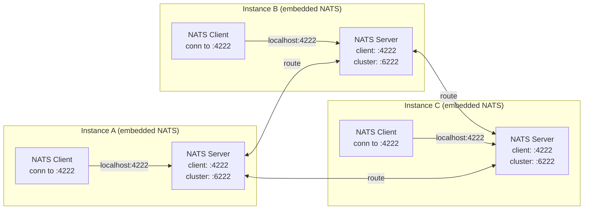

**NATS subject topology:**

```
webhook.>              ← wildcard subscription (feeds ring buffer on each instance)
webhook.{channelID}    ← per-channel publish/subscribe
webhook.abc123         ← example channel
webhook.xyz789         ← example channel
```

**How NATS distributes a publish across the cluster:**

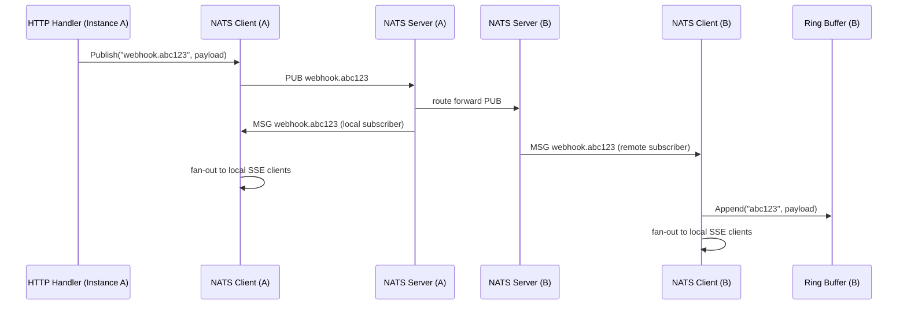

**NATS embedded server configuration:**

```go
server.Options{
    Port:    4222,                              // client connections
    Cluster: server.ClusterOpts{
        Port:   6222,                           // cluster routes
        Routes: []*url.URL{
            url.Parse("nats://host2:6222"),     // peer routes
            url.Parse("nats://host3:6222"),
        },
    },
    JetStream: false,                           // core NATS only, no JetStream
    NoLog:    true,                             // suppress NATS logs
    NoSigs:   true,                             // gohookbridge handles signals
}
```

**Client connection (in-process, no network):**
```go
nc, _ := nats.Connect("nats://localhost:4222")
nc.Subscribe("webhook.>", func(msg *nats.Msg) {
    channel := strings.TrimPrefix(msg.Subject, "webhook.")
    buffer.Append(channel, msg.Data)     // feed ring buffer
    fanout(channel, msg.Data)            // dispatch to live SSE subscribers
})
```

---

### Ring Buffer — Late Subscriber Catch-up

A per-instance, in-memory ring buffer with time-based eviction. Provides recent webhooks to SSE clients that connect after the webhook was sent.

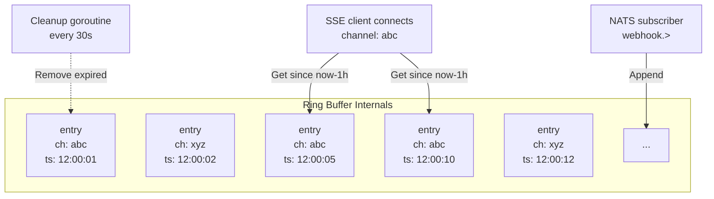

**Data structure:**

```go
type entry struct {
    channel   string
    data      []byte
    timestamp time.Time
}

type RingBuffer struct {
    mu      sync.RWMutex
    entries []entry
    maxSize int           // max number of entries (default: 10000)
    maxAge  time.Duration // max entry age before eviction (default: 1h)
}
```

**Operations:**

| Operation | Behavior |
|---|---|
| `Append(channel, data)` | Append to slice. If `len > maxSize`, evict oldest entry. O(1) amortized. |
| `Get(channel, since, limit)` | Linear scan for matching channel + newer than since, return up to limit. O(n). |
| Cleanup goroutine | Every 30s, remove all entries older than `now - maxAge`. Runs as background goroutine. |

**TTL eviction flow:**

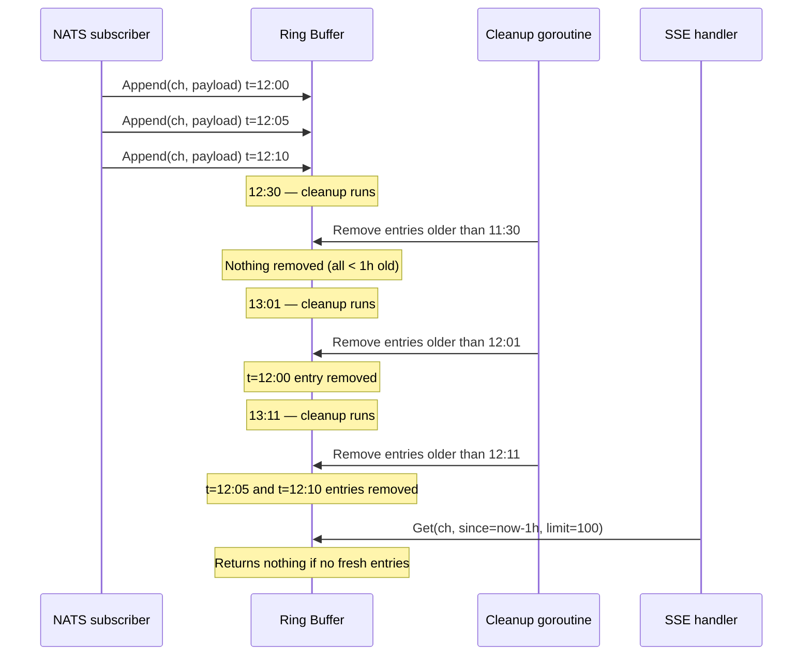

**Memory estimation:**
- 10000 entries × ~16KB average payload = ~160MB max
- With TTL of 1h and typical webhook rate of 100/min: ~6000 entries, ~96MB typical
- Configurable via `--nats-buffer-size` and `--nats-buffer-ttl`

---

### SSE Endpoint — Client Subscribe/Push

The SSE endpoint (`GET /events/{channel}`) is how gohookbridge clients receive webhooks. The handler is modified to drain the ring buffer first, then subscribe to live NATS events.

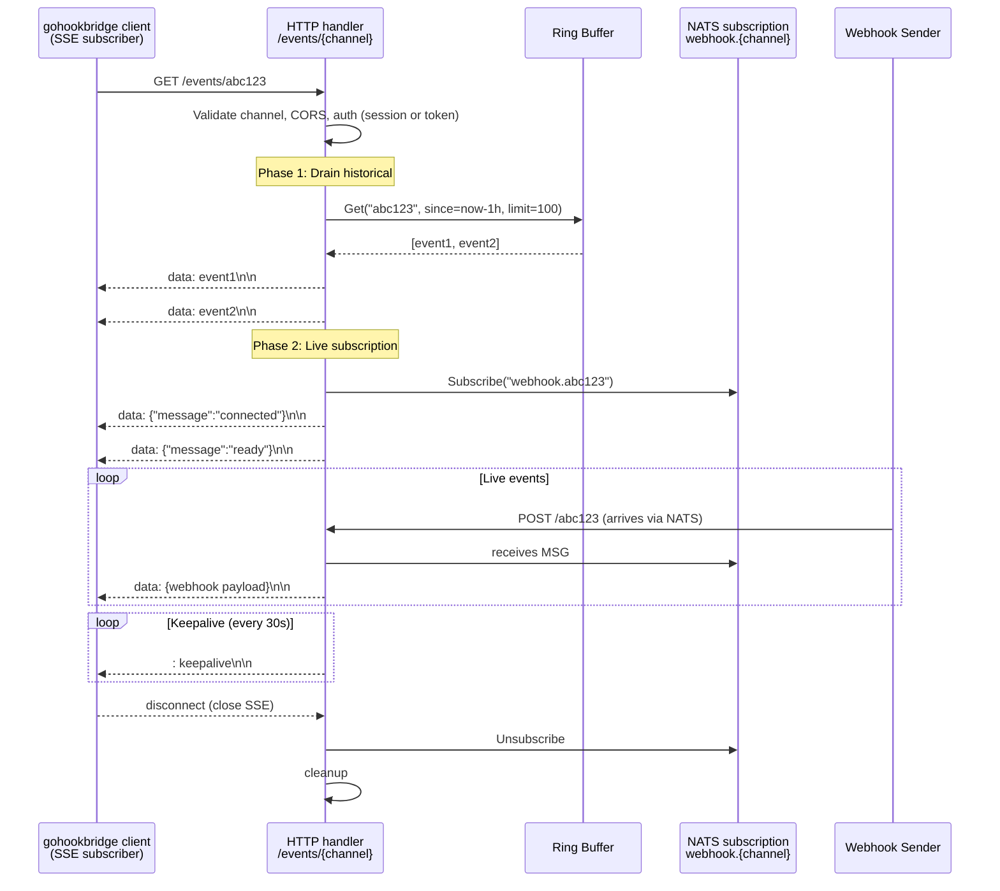

**Handler logic (pseudocode):**

```go
func handleEventsGet(broker *nats.Broker, rs *store.RaftStore) http.HandlerFunc {
    return func(w http.ResponseWriter, r *http.Request) {
        channel := chi.URLParam(r, "channel")
        // ... validation, auth, CORS ...

        w.Header().Set("Content-Type", "text/event-stream")
        // ... SSE headers ...

        if broker != nil {
            // Phase 1: drain ring buffer
            historical, liveCh := broker.Subscribe(channel, 100)
            for _, data := range historical {
                fmt.Fprintf(w, "data: %s\n\n", data)
                flusher.Flush()
            }

            // Phase 2: live NATS events + keepalive
            fmt.Fprintf(w, "data: %s\n\n", `{"message":"connected"}`)
            fmt.Fprintf(w, "data: %s\n\n", `{"message":"ready"}`)
            flusher.Flush()

            ticker := time.NewTicker(30 * time.Second)
            defer ticker.Stop()
            for {
                select {
                case <-r.Context().Done():
                    broker.Unsubscribe(channel, liveCh)
                    return
                case data, ok := <-liveCh:
                    if !ok { return }
                    fmt.Fprintf(w, "data: %s\n\n", data)
                    flusher.Flush()
                case <-ticker.C:
                    fmt.Fprint(w, ": keepalive\n\n")
                    flusher.Flush()
                }
            }
        } else {
            // Fallback: existing EventBroker (single-instance, no NATS)
            // ... unchanged code ...
        }
    }
}
```

**Broker Subscribe internals:**

```go
func (b *Broker) Subscribe(channel string, limit int) (historical [][]byte, live <-chan []byte) {
    // 1. Drain historical from ring buffer
    historical = b.buffer.Get(channel, time.Now().Add(-b.buffer.maxAge), limit)

    // 2. Create live channel
    ch := make(chan []byte, 100)
    b.mu.Lock()
    if b.subs[channel] == nil {
        b.subs[channel] = make(map[chan []byte]struct{})
    }
    b.subs[channel][ch] = struct{}{}
    b.mu.Unlock()

    return historical, ch
}
```

---

## Data Flows

### Webhook POST (Publish)

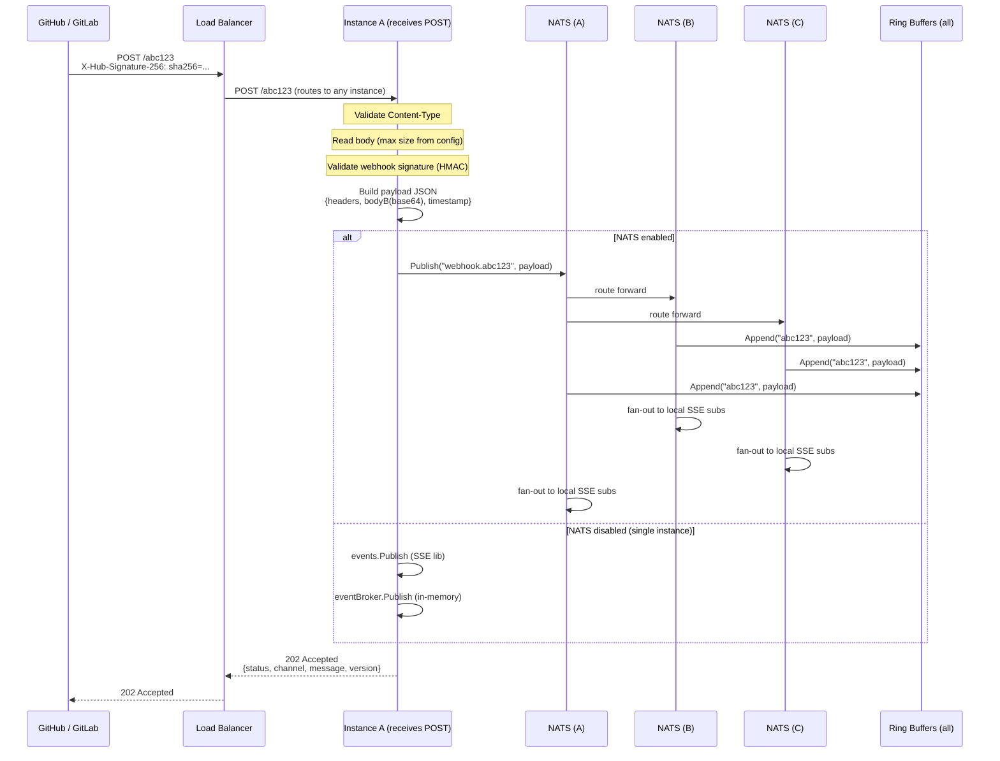

**Validation chain (unchanged from current):**
1. `Content-Type: application/json` check
2. `MaxBytesReader` limit (project-level or global default)
3. Webhook signature validation (GitHub HMAC-SHA256, GitLab token, Bitbucket HMAC, Gitea)
4. JSON parsing
5. IP allowlist (if configured)

After validation, the re-encoded payload is published to NATS.

---

### SSE Subscribe + Receive

Covered in [SSE Endpoint section](#sse-endpoint--client-subscribepush) above. Diagram repeated here for flow completeness.

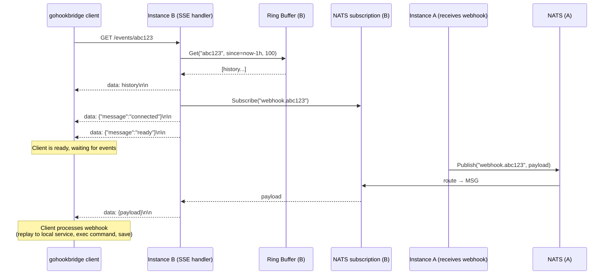

---

### Replay POST

Replay (`POST /replay/{channel}`) uses the same NATS publish path. The replay endpoint validates the Bearer token from the project/global config, then publishes to NATS.

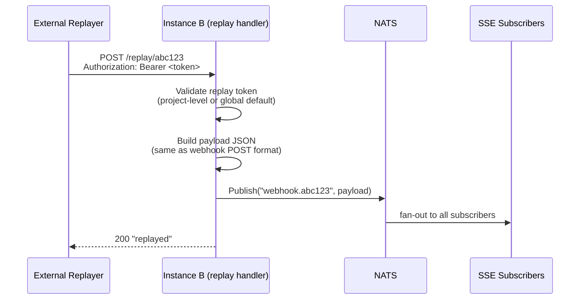

**Difference from webhook POST:** Replay skips signature validation and IP allowlist, requires Bearer token instead.

---

### Ring Buffer Eviction

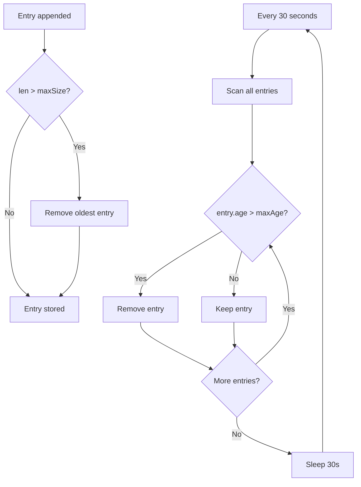

**Eviction is dual-threshold:**
1. **Size-based**: When `len(entries) > maxSize`, oldest entry removed on append (instant)
2. **Time-based**: Cleanup goroutine removes entries older than `maxAge` every 30 seconds

---

## HA Scenarios

### Cross-instance Delivery

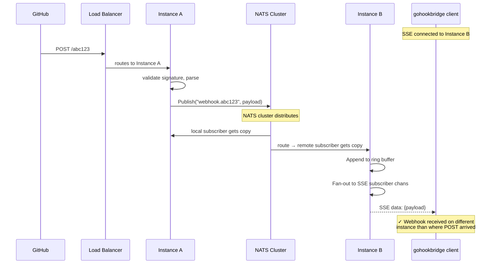

**Key insight:** The load balancer can route POST to any instance, and the SSE client can connect to any (potentially different) instance. NATS ensures the message reaches all instances.

### Late Subscriber Join

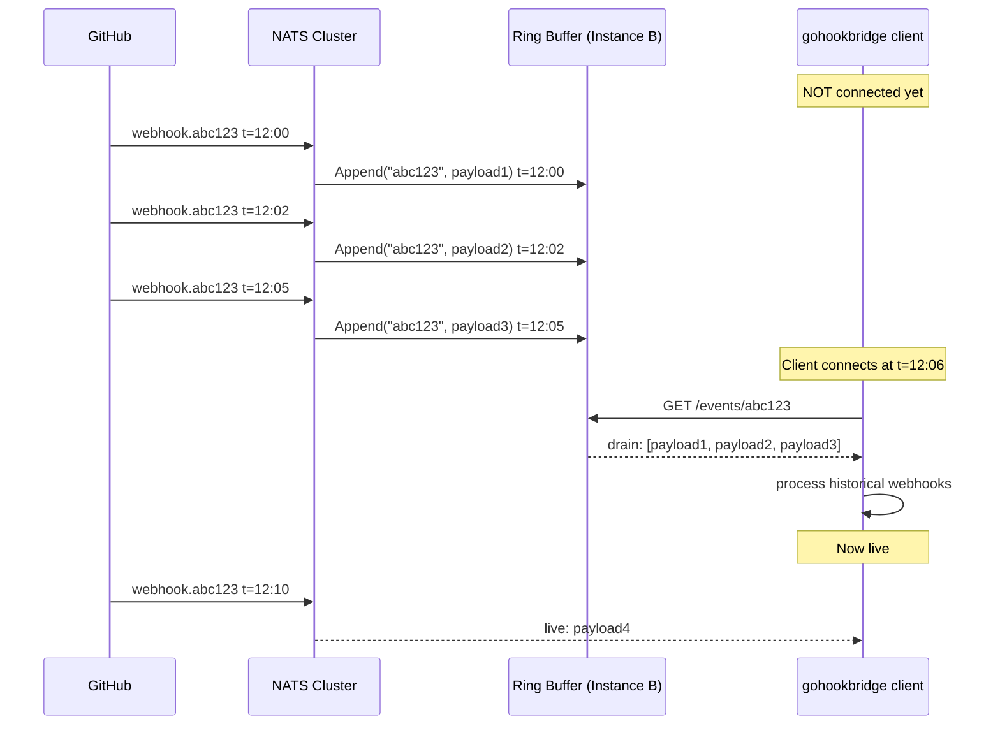

**Ring buffer Get logic:**
- `since` defaults to `now - maxAge` (1 hour)
- Returns entries in chronological order (appended order)
- Limits to `limit` entries (default 100)

### Node Failure

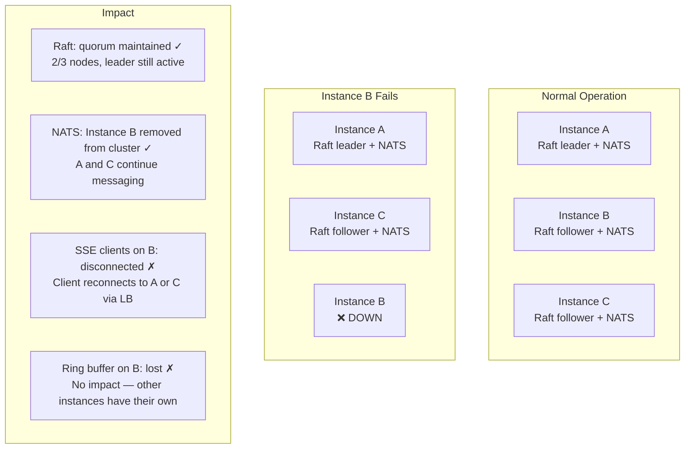

**Recovery when Instance B comes back:**
1. Raft: catches up via AppendEntries from leader
2. NATS: reconnects to cluster, syncs routes
3. Ring buffer: starts fresh (empty)
4. SSE clients: reconnect via load balancer health checks

**No data loss:** Webhooks are ephemeral by nature. The sender (GitHub/GitLab) will retry if no 202 response is received. Late subscribers on surviving instances get webhooks from their ring buffers.

---

## Configuration Mapping

### Server flags (HA deployment example)

```bash
# Instance 1
gohookbridge server \
  --address 0.0.0.0 --port 3333 \
  --public-url https://webhook.example.com \
  --raft-dir /data/raft \
  --raft-node-id node1 \
  --raft-bind-addr 10.0.0.1:6001 \
  --raft-peers node2=10.0.0.2:6001,node3=10.0.0.3:6001 \
  --nats-port 4222 \
  --nats-cluster-port 6222 \
  --nats-routes nats://10.0.0.2:6222,nats://10.0.0.3:6222 \
  --nats-buffer-ttl 1h \
  --nats-buffer-size 10000 \
  --bootstrap-config-file /etc/gohookbridge/bootstrap.yaml

# Instance 2
gohookbridge server \
  --address 0.0.0.0 --port 3333 \
  --public-url https://webhook.example.com \
  --raft-dir /data/raft \
  --raft-node-id node2 \
  --raft-bind-addr 10.0.0.2:6001 \
  --raft-peers node1=10.0.0.1:6001,node3=10.0.0.3:6001 \
  --nats-port 4222 \
  --nats-cluster-port 6222 \
  --nats-routes nats://10.0.0.1:6222,nats://10.0.0.3:6222 \
  --bootstrap-config-file /etc/gohookbridge/bootstrap.yaml

# Instance 3 — same pattern
```

### Port layout

| Port | Protocol | Purpose |
|---|---|---|
| 3333 | HTTP/HTTPS | Webhook ingestion + SSE + Admin UI + API |
| 6001 | TCP (Raft) | Configuration consensus between Raft nodes |
| 4222 | TCP (NATS client) | NATS client connections (in-process, localhost only) |
| 6222 | TCP (NATS cluster) | NATS inter-node cluster routes |

---

## Backward Compatibility

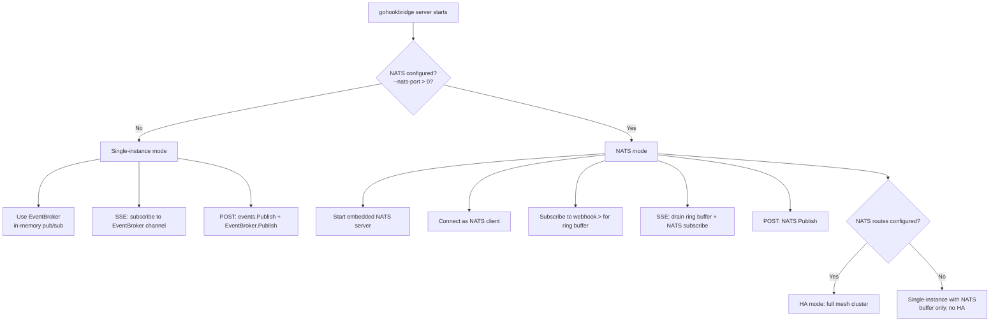

**Zero-config default:** Without `--nats-port`, behavior is identical to current. No breaking changes. No new required dependencies for existing deployments.

**Single-instance with NATS:** Set `--nats-port 4222` without `--nats-routes` for buffer-only mode (late subscriber catch-up without HA clustering).

---

## Error Handling

### NATS unavailable at publish time
- NATS client has built-in reconnect with backoff
- If NATS is down, publish returns error → HTTP handler returns 503
- Sender (GitHub) will retry the webhook

### NATS server crash
- Embedded server process is the same as gohookbridge → crash kills gohookbridge
- Systemd/Kubernetes restarts the pod
- Raft and NATS both recover from their persisted state

### Ring buffer full
- Oldest entries evicted on append (FIFO)
- SSE client may not receive all historical messages
- Acceptable: webhooks are best-effort, sender retries

### SSE client disconnect during live stream
- `r.Context().Done()` fires → handler calls `broker.Unsubscribe()`
- Channel closed, goroutine exits
- No resource leak
